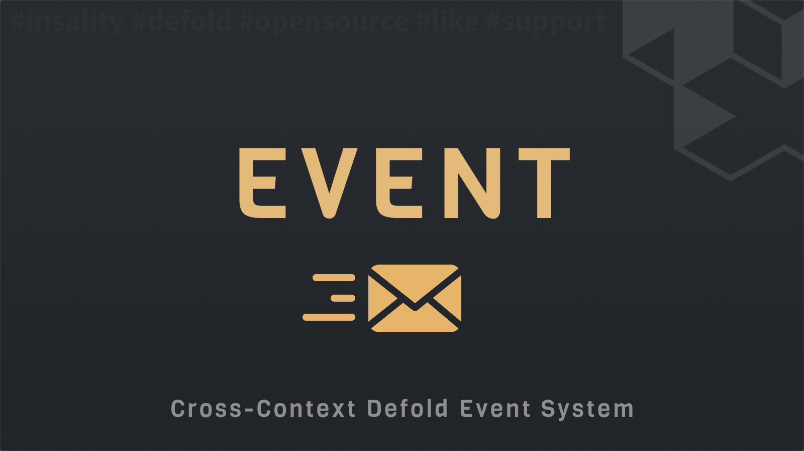

[](https://github.com/Insality/defold-event/tags)
[](https://github.com/Insality/defold-event/actions)
[](https://codecov.io/gh/Insality/defold-event)

[](https://github.com/sponsors/insality) [](https://ko-fi.com/insality) [](https://www.buymeacoffee.com/insality)


# Event

**Event** - is a single file Lua module for the [Defold](https://defold.com/) game engine. It provides a simple and efficient way to manage events and callbacks in your game.


## Features

- **Event Management**: Create, subscribe, unsubscribe, and trigger events.
- **Cross-Context**: You can subscribe to events from different scripts.
- **Callback Management**: Attach callbacks to events with optional data.
- **Global Events**: Create and subscribe global events that can be triggered from anywhere in your game.
- **Logging**: Set a logger to log event activities.
- **Memory Allocations Tracker**: Detects if an event callback causes a huge memory allocations.


## Setup

### [Dependency](https://www.defold.com/manuals/libraries/)

Open your `game.project` file and add the following line to the dependencies field under the project section:

**[Event v3](https://github.com/Insality/defold-event/archive/refs/tags/2.zip)**

```
https://github.com/Insality/defold-event/archive/refs/tags/2.zip
```

### Library Size

> **Note:** The library size is calculated based on the build report per platform

| Platform         | Library Size |
| ---------------- | ------------ |
| HTML5            | **1.96 KB**  |
| Desktop / Mobile | **3.35 KB**  |


### Lua Script Instance Compatibility

The project already includes the [Lua Script Instance](https://github.com/DanEngelbrecht/LuaScriptInstance/) library. If Lua Script Instance is listed in your project's dependencies, remove it to prevent duplication.


### Memory Allocation Tracking

**Enabling in `game.project`**

To monitor memory allocations for event callbacks, add to your `game.project`:

```ini
[event]
memory_threshold_warning = 50
```

- `memory_threshold_warning`: Threshold in kilobytes for logging warnings about memory allocations. `0` disables tracking.

**Release Build Behavior**

Memory allocation tracking is turned off in release builds, regardless of the `game.project` settings.


## API Reference

### Quick API Reference

```lua
-- Event Module
event.set_logger(logger)
event.create(callback, [callback_context])
event:subscribe(callback, [callback_context])
event:unsubscribe(callback, [callback_context])
event:is_subscribed(callback, [callback_context])
event:trigger(...)
event:is_empty()
event:clear()

-- Global Events Module
events.subscribe(name, callback, [callback_context])
events.unsubscribe(name, callback, [callback_context])
events.is_subscribed(name, callback, [callback_context])
events.trigger(name, ...)
events.is_empty(name)
events.clear(name)
events.clear_all()
```

### Setup and Initialization

To start using the Event module in your project, you first need to import it. This can be done with the following line of code:

```lua
local event = require("event.event")
```

### Configuration Functions

**event.set_logger**
---
Customize the logging mechanism used by Event module. You can use **Defold Log** library or provide a custom logger.

```lua
event.set_logger([logger_instance])
```

- **Parameters:**
  - `logger_instance` (optional): A logger object that follows the specified logging interface, including methods for `trace`, `debug`, `info`, `warn`, `error`. Pass `nil` to remove the default logger.

- **Usage Example:**

Using the [Defold Log](https://github.com/Insality/defold-log) module:
```lua
-- Use defold-log module
local log = require("log.log")
local event = require("event.event")

event.set_logger(log.get_logger("event"))
```

Creating a custom user logger:
```lua
-- Create a custom logger
local logger = {
    trace = function(_, message, context) end,
    debug = function(_, message, context) end,
    info = function(_, message, context) end,
    warn = function(_, message, context) end,
    error = function(_, message, context) end
}
event.set_logger(logger)
```

Remove the default logger:
```lua
event.set_logger(nil)
```

### Core Functions

**event.create**
---
```lua
event.create(callback, [callback_context])
```
Generate a new event instance. This instance can then be used to subscribe to and trigger events.

- **Parameters:**
  - `callback`: The function to be called when the event is triggered.
  - `callback_context` (optional): The first parameter to be passed to the callback function.

- **Return Value:** A new event instance.

- **Usage Example:**

```lua
local callback = function(self) print("clicked!") end
local on_click_event = event.create(callback, self)
```

### Event Instance Methods

Once an event instance is created, you can interact with it using the following methods:

**event:subscribe**
---
```lua
event:subscribe(callback, [callback_context])
```
Subscribe a callback to the event. The callback will be invoked whenever the event is triggered.

- **Parameters:**
  - `callback`: The function to be executed when the event occurs.
  - `callback_context` (optional): The first parameter to be passed to the callback function.

- **Return Value:** `true` if the subscription was successful, `false` otherwise.

- **Usage Example:**

```lua
on_click_event:subscribe(callback, self)
```

**event:unsubscribe**
---
```lua
event:unsubscribe(callback, [callback_context])
```
Remove a previously subscribed callback from the event.

- **Parameters:**
  - `callback`: The callback function to unsubscribe.
  - `callback_context` (optional): The first parameter to be passed to the callback function.

- **Return Value:** `true` if the unsubscription was successful, `false` otherwise.

- **Usage Example:**

```lua
on_click_event:unsubscribe(callback, self)
```

**event:is_subscribed**
---
```lua
event:is_subscribed(callback, [callback_context])
```
Determine if a specific callback is currently subscribed to the event.

- **Parameters:**
  - `callback`: The callback function in question.
  - `callback_context` (optional): The first parameter to be passed to the callback function.

- **Return Value:** `true` if the callback is subscribed to the event, `false` otherwise.

- **Usage Example:**

```lua
local is_subscribed = on_click_event:is_subscribed(callback, self)
```

**event:trigger**
---
```lua
event:trigger(...)
```
Trigger the event, causing all subscribed callbacks to be executed.

- **Parameters:** Any number of parameters to be passed to the subscribed callbacks.

- **Return Value:** The return value of the last callback executed.

- **Usage Example:**

```lua
on_click_event:trigger("arg1", "arg2")
```

**event:is_empty**
---
```lua
event:is_empty()
```
Check if the event has no subscribed callbacks.

- **Return Value:** `true` if the event has no subscribed callbacks, `false` otherwise.

- **Usage Example:**

```lua
local is_empty = on_click_event:is_empty()
```

**event:clear**
---
```lua
event:clear()
```
Remove all callbacks subscribed to the event, effectively resetting it.

- **Usage Example:**

```lua
on_click_event:clear()
```

This comprehensive API facilitates the creation and management of events within your projects, enhancing modularity and interaction between different components. Enjoy the power and flexibility of the Event library in your Lua projects!


### Global Events Module

The Event library comes with a global events module that allows you to create and manage global events that can be triggered from anywhere in your game. This is particularly useful for events that need to be handled by multiple scripts or systems.

To start using the **Events** module in your project, you first need to import it. This can be done with the following line of code:

Global events module requires careful management of subscriptions and unsubscriptions to prevent errors.


```lua
local events = require("event.events")
```

**events.subscribe**
---
```lua
events.subscribe(name, callback, [callback_context])
```
Subscribe a callback to the specified global event.

- **Parameters:**
  - `name`: The name of the global event to subscribe to.
  - `callback`: The function to be executed when the global event occurs.
  - `callback_context` (optional): The first parameter to be passed to the callback function.

- **Usage Example:**

```lua
events.subscribe("on_game_over", callback, self)
```

**events.unsubscribe**
---
```lua
events.unsubscribe(name, callback, [callback_context])
```
Remove a previously subscribed callback from the specified global event.

- **Parameters:**
  - `name`: The name of the global event to unsubscribe from.
  - `callback`: The callback function to unsubscribe.
  - `callback_context` (optional): The first parameter to be passed to the callback function.

- **Usage Example:**

```lua
events.unsubscribe("on_game_over", callback, self)
```

**events.is_subscribed**
---
```lua
events.is_subscribed(name, callback, [callback_context])
```
Determine if a specific callback is currently subscribed to the specified global event.

- **Parameters:**
  - `name`: The name of the global event in question.
  - `callback`: The callback function in question.
  - `callback_context` (optional): The first parameter to be passed to the callback function.

- **Return Value:** `true` if the callback is subscribed to the global event, `false` otherwise.

- **Usage Example:**

```lua
local is_subscribed = events.is_subscribed("on_game_over", callback, self)
```

**events.trigger**
---
```lua
events.trigger(name, ...)
```
Throw a global event with the specified name. All subscribed callbacks will be executed.

- **Parameters:**
  - `name`: The name of the global event to trigger.
  - `...`: Any number of parameters to be passed to the subscribed callbacks.

- **Usage Example:**

```lua
events.trigger("on_game_over", "arg1", "arg2")
```

**events.is_empty**
---
```lua
events.is_empty(name)
```
Check if the specified global event has no subscribed callbacks.

- **Parameters:**
  - `name`: The name of the global event to check.

- **Return Value:** `true` if the global event has no subscribed callbacks, `false` otherwise.

- **Usage Example:**

```lua
local is_empty = events.is_empty("on_game_over")
```

**events.clear**
---
```lua
events.clear(name)
```
Remove all callbacks subscribed to the specified global event.

- **Parameters:**
  - `name`: The name of the global event to clear.

- **Usage Example:**

```lua
events.clear("on_game_over")
```

**events.clear_all**
---
```lua
events.clear_all()
```
Remove all callbacks subscribed to all global events.

- **Usage Example:**

```lua
events.clear_all()
```

The **Events** module provides a powerful and flexible way to manage global events in your Defold projects. Use it to create modular and extensible systems that can respond to events from anywhere in your game.


## Use Cases

Read the [Use Cases](USE_CASES.md) file to see several examples of how to use the Event module in your Defold game development projects.


## License

This project is licensed under the MIT License - see the LICENSE file for details.

Used libraries:
- [Lua Script Instance](https://github.com/DanEngelbrecht/LuaScriptInstance/)


## Issues and suggestions

If you have any issues, questions or suggestions please [create an issue](https://github.com/Insality/defold-event/issues).


## 👏 Contributors

<a href="https://github.com/Insality/defold-event/graphs/contributors">
  
</a>


## Changelog

### **V1**
<details>
	<summary><b>Changelog</b></summary>

	- Initial release
</details>

### **V2**
<details>
	<summary><b>Changelog</b></summary>

	- Add global events module
	- The `event:subscribe` and `event:unsubscribe` now return boolean value of success
</details>

### **V3**
<details>
	<summary><b>Changelog</b></summary>

	- Event Trigger now returns value of last executed callback
	- Add `events.is_empty(name)` function
	- Add tests for Event and Global Events modules
</details>


## ❤️ Support project ❤️

Your donation helps me stay engaged in creating valuable projects for **Defold**. If you appreciate what I'm doing, please consider supporting me!

[](https://github.com/sponsors/insality) [](https://ko-fi.com/insality) [](https://www.buymeacoffee.com/insality)
